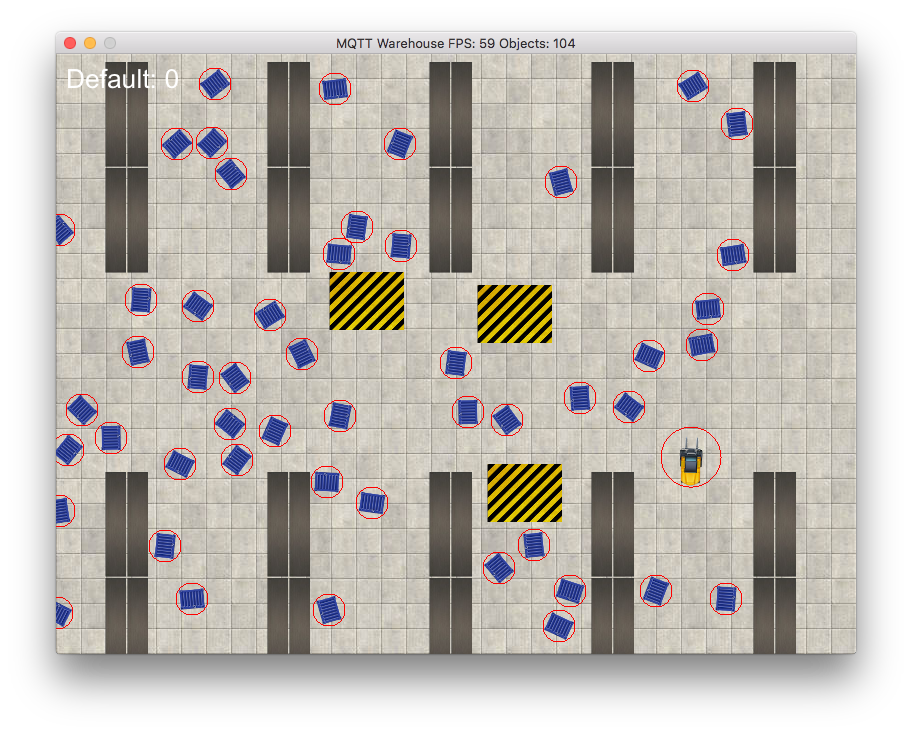

# MQTT Warehouse

> **MQTT Warehouse** is a cute simulation of an intelligent Internet of Things warehouse where forklifts can be driven by MQTT.

MQTT Warehouse has been created by hackers at [Juicymo](https://www.juicymo.cz) with love in Prague during two days and two nights.

MQTT Warehouse is proudly used on [Unicorn College](https://www.unicorncollege.cz/) during the summer semester course *MC1: An introduction to Microcomputers*.



Goal
====

Your task is to create an application which is able to control a forklift over MQTT. It is up to you which programing language or framework will you pick. Our recommendation is [Node-RED](https://nodered.org/) with a [flavor of coffee](https://flows.nodered.org/node/node-red-contrib-coffeescript).

Your goal is to drive a `forklift` in the warehouse. 

* You must avoid `shelves` and other `forklifts`. That will cost you points.
* You should pickup `containers` with goods and transport them to designated `unloading zones`. For this you will receive points.
* When loaded with container, you must avoid other containers till you reach the unloading zone. Collisions will cost you points.
* Your goal is to get the biggest score!

Yes, MQTT Warehouse supports multi-player!

You control your forklift by setting a velocity and angular acceleration. But beware, dampening is applied to you movement. The forklift controller will compute all the heavy math connected with motor control for you.

The warehouse is equipped with a state-of-the-art detection technology and it is able to send you all needed data about everything in the warehouse over MQTT. You can access information about position and rotation of all static elements as well their size. The warehouse periodically updates you with status of all forklifts in the area.

And an awesome visualization is available as well!

Technology
==========
MQTT Warehouse is built in the [Ruby](https://www.ruby-lang.org/en/) programming language using the awesome [Gosu](https://github.com/gosu/gosu) and [Chingu](https://github.com/ippa/chingu) Ruby game development libraries.

We actually extended the Chingu library with two additional traits in order to implement a better support for rotation and mainly direction based control of game objects. That is what allows that cute forklift movement.

Installation
============
In order to run the MQTT Warehouse locally, do the following:

1. Install RVM (see how on [https://rvm.io/](https://rvm.io/))
2. Install Ruby 2.3.3 (`rvm install 2.3.3`)
3. Install Mosquitto MQTT Broker (`brew install mosquitto`, if you don't have Homebrew, install it from here: [https://brew.sh/](https://brew.sh/))
4. Run Mosquitto (`mosquitto -c /usr/local/etc/mosquitto/mosquitto.conf`)
5. Clone this git repository (`git clone TODO`)
6. Let the Bundler install all dependencies (`bundle install`)
7. Run the MQTT Warehouse (`ruby warehouse.rb`)

You can control the Default forklift with the arrow keys.

For MQTT communication see the usage below.

Usage
=====
In order to join the warehouse, first a "handshake" has to be performed. During the handshake a new forklift will be created.

Handshake
---------
MQTT Warehouse contain a secure way of new forklifts creation and control so the players cannot control forklifts which does not belong to them. This is why a handshake is needed.

1. When the MQTT Warehouse Ruby app and your Mosquitto broker are running, subscribe to a `warehouse/created/<ACCESS_KEY>` MQTT topic, substitute `<ACCESS_KEY>` for your secret one time key which will be used to send your forklift's `ACCESS_TOKEN`. Example of `ACCESS_KEY` can be `cuterobot` or `HDhwu8s88ZNYg1hVsiJuKfOESQPY` - it is entirely up to you. In this topic you will receive your forklift's `ACCESS_TOKEN` which you will need to control your forklift.

You can subscribe the topic either directly in your control app or via Mosquitto CLI (we have used `cuterobot` as the `ACCESS_KEY`):

```bash
mosquitto_sub -v -t 'warehouse/created/cuterobot' 
```

2. Now access (publish to) the `warehouse/create` MQTT topic with payload: `name=<FORKLIFT_NAME>,key=<ACCESS_KEY>`, substitute `<ACCESS_KEY>` for your secret one time key you have chosen in step 1 (`cuterobot` in our example) and `<FORKLIFT_NAME>` for your forklift's nickname (nickname will be visible by others).

You can publish to the topic either directly from your control app or via Mosquitto CLI (we have used `Robot` as the `FORKLIFT_NAME`):

```bash
mosquitto_pub -t 'warehouse/create' -m 'name=Robot,key=cuterobot'
```

3. Now MQTT Warehouse will create a brand new forklift for you and place it into the warehouse. It will publish your access token in the topic you have subscribed in step 1.

Output from mosquitto_sub should look similar to this:

```bash
warehouse/created/cuterobot name=Robot,token=daae060e7e872f812e20b03810f2f4df351fd446
```

From here copy the `daae060e7e872f812e20b03810f2f4df351fd446` which is your `ACCESS_TOKEN`. You will need it in the next steps.

Congratulations! Your MQTT Warehouse handshake is DONE and you can enjoy controlling your forklift.

Forklift control
----------------
With an `ACCESS_TOKEN`, you can perform the following actions:

* Control movement of your forklift `warehouse/<ACCESS_TOKEN>/control`
* Read status of your forklift `warehouse/<ACCESS_TOKEN>/status`
* Remove your forklift from the warehouse (a new handshake will be required in order to create a new one) `warehouse/<ACCESS_TOKEN>/remove`

Even without an `ACCESS_TOKEN`, you can read warehouse settings and status:

* `warehouse/status` - provides information about movings objects (like forklifts and containers current position and rotation)
* `warehouse/settings` - provides information about static objects (shelves and zones) and about all object dimensions (which do not change durring the simulation)

> Beware! For performance reasons only one message per forklift is processed per tick! This prevents overloading the simulation by spaming MQTT messages. Always sent MQTT message only when you need it, the more MQTT messages you sent, the more delay between the message creation and processing for your forklift!

**Move a forklift**

In order to move your forklift, a payload containing desired *angular acceleration* and/or *movement velocity* has to be published to topic `warehouse/<ACCESS_TOKEN>/control` where `<ACCESS_TOKEN>` has to be substituted by your `ACCESS_TOKEN`.

Payload should look like this:

```
r=<ANGULAR_ACCELERATION>,m=<MOVEMENT_VELOCITY>
```

For example payload:

```
r=0.5,m=0.4
```

will set *angular acceleration* to `0.5` and *movement velocity* to `0.4`. Forklift is always moving towards a direction where it faces.

Changes are applied immediately the message is received.

* allowed range for *angular acceleration* is between `-1.0` and `1.0`
* allowed range for *movement velocity* is between `-0.5` and `0.5`

MQTT Warehouse simulated basic physics have constant **movement dampening** of `0.004` which is applied, once per tick, 60 times per second. This provides a slight deceleration to all forklifts.

Example MQTT message can be sent via Mosquitto CLI:

Rotate right, move forward at full speed:

```bash
mosquitto_pub -t 'warehouse/daae060e7e872f812e20b03810f2f4df351fd446/control' -m 'r=0.2,m=0.5'
```

Rotate right, break or move backwards at full speed.

```bash
mosquitto_pub -t 'warehouse/daae060e7e872f812e20b03810f2f4df351fd446/control' -m 'r=-0.2,m=-0.5'
```

Stop rotation, slowly move forward:

```bash
mosquitto_pub -t 'warehouse/daae060e7e872f812e20b03810f2f4df351fd446/control' -m 'r=0.0,m=0.1'
```

All stop (both movement and rotation):

```bash
mosquitto_pub -t 'warehouse/daae060e7e872f812e20b03810f2f4df351fd446/control' -m 'r=0.0,m=0.0'
```

**Remove a forklift**

In order to remove your forklift from the warehouse, publish a message to topic `warehouse/<ACCESS_TOKEN>/control` where `<ACCESS_TOKEN>` has to be substituted by your `ACCESS_TOKEN`.

When forklift is removed, its score, access key and access token are erased. In order to re-create it a new handshake has to be performed.

Payload is ignored for this message.

Example MQTT message can be sent via Mosquitto CLI:

```bash
mosquitto_pub -t 'warehouse/daae060e7e872f812e20b03810f2f4df351fd446/remove' -m ''
```

**See a forklift status**

```bash
mosquitto_sub -v -t 'warehouse/daae060e7e872f812e20b03810f2f4df351fd446/status'
```

Payload of this topic is JSON in the following format:

```json
{
  "status": {
	"name": "Robot",
	"x": 341.40657802864234,
	"y": 288.36168023734655,
	"angle": 232,
	"score": 0,
	"loaded": false
  },
  "time": "2017-03-12 20:50:32 +0100"
}
```

**See warehouse status**

This topic provides information about status of all dynamic elements in the warehouse - like forklifts and containers.

New message is broadcasted regularly by the warehouse. Regular updates from this topic can be used for your forklift controlling logic.

```bash
mosquitto_sub -v -t 'warehouse/status'
```

Payload of this topic is JSON in the following format:

```json
{
  "forklifts": {
	"Default": {
	  "name": "Default",
	  "x": 495,
	  "y": 98,
	  "angle": 81,
	  "score": 0,
	  "loaded": false
	},
	"Robot": {
	  "name": "Robot",
	  "x": 335.2759202314379,
	  "y": 280.5147960899757,
	  "angle": 232,
	  "score": 0,
	  "loaded": false
	}
  },
  "containers": [
	{
	  "x": 493,
	  "y": 540
	},
	{
	  "x": 314,
	  "y": 483
	},
	{
	  "x": 188,
	  "y": 556
	},
	{
	  "x": 276,
	  "y": 751
	},
	{
	  "x": 581,
	  "y": 645
	},
	{
	  "x": 30,
	  "y": 508
	},
	{
	  "x": 436,
	  "y": 101
	},
	{
	  "x": 205,
	  "y": 660
	},
	{
	  "x": 329,
	  "y": 217
	},
	{
	  "x": 191,
	  "y": 509
	},
	{
	  "x": 455,
	  "y": 542
	},
	{
	  "x": 157,
	  "y": 700
	},
	{
	  "x": 18,
	  "y": 382
	},
	{
	  "x": 355,
	  "y": 736
	},
	{
	  "x": 183,
	  "y": 746
	},
	{
	  "x": 458,
	  "y": 231
	},
	{
	  "x": 353,
	  "y": 686
	},
	{
	  "x": 539,
	  "y": 765
	},
	{
	  "x": 141,
	  "y": 398
	},
	{
	  "x": 471,
	  "y": 307
	}
  ],
  "time": "2017-03-12 20:51:14 +0100"
}
```

**See warehouse settings**

This topic provides all static information from the warehouse - like dimensions of all objects and positions of all objects which are not moved in the simulation - like shelves and zones.

When a new MQTT warehouse is generated, new message into this topic (`warehouse/settings`) is posted.

This MQTT message is retained. So newly connected subscribers will receive it as well (even if they will connect after the message was posted).

```bash
mosquitto_sub -v -t 'warehouse/settings'
```

Payload of this topic is JSON in the following format:

```json
{
  "dimensions": {
	"arena": {
	  "h": 800,
	  "w": 640
	},
	"forklift": {
	  "h": 25,
	  "w": 59
	},
	"container": {
	  "h": 20,
	  "w": 25
	},
	"zone": {
	  "h": 58,
	  "w": 75
	},
	"shelve": {
	  "h": 105,
	  "w": 21
	}
  },
  "positions": {
	"shelves": [
	  {
		"x": 60,
		"y": 60
	  },
	  {
		"x": 82,
		"y": 60
	  },
	  {
		"x": 60,
		"y": 166
	  },
	  {
		"x": 82,
		"y": 166
	  },
	  {
		"x": 222,
		"y": 60
	  },
	  {
		"x": 244,
		"y": 60
	  },
	  {
		"x": 222,
		"y": 166
	  },
	  {
		"x": 244,
		"y": 166
	  },
	  {
		"x": 384,
		"y": 60
	  },
	  {
		"x": 406,
		"y": 60
	  },
	  {
		"x": 384,
		"y": 166
	  },
	  {
		"x": 406,
		"y": 166
	  },
	  {
		"x": 546,
		"y": 60
	  },
	  {
		"x": 568,
		"y": 60
	  },
	  {
		"x": 546,
		"y": 166
	  },
	  {
		"x": 568,
		"y": 166
	  },
	  {
		"x": 708,
		"y": 60
	  },
	  {
		"x": 730,
		"y": 60
	  },
	  {
		"x": 708,
		"y": 166
	  },
	  {
		"x": 730,
		"y": 166
	  },
	  {
		"x": 870,
		"y": 60
	  },
	  {
		"x": 892,
		"y": 60
	  },
	  {
		"x": 870,
		"y": 166
	  },
	  {
		"x": 892,
		"y": 166
	  },
	  {
		"x": 60,
		"y": 470
	  },
	  {
		"x": 82,
		"y": 470
	  },
	  {
		"x": 60,
		"y": 576
	  },
	  {
		"x": 82,
		"y": 576
	  },
	  {
		"x": 222,
		"y": 470
	  },
	  {
		"x": 244,
		"y": 470
	  },
	  {
		"x": 222,
		"y": 576
	  },
	  {
		"x": 244,
		"y": 576
	  },
	  {
		"x": 384,
		"y": 470
	  },
	  {
		"x": 406,
		"y": 470
	  },
	  {
		"x": 384,
		"y": 576
	  },
	  {
		"x": 406,
		"y": 576
	  },
	  {
		"x": 546,
		"y": 470
	  },
	  {
		"x": 568,
		"y": 470
	  },
	  {
		"x": 546,
		"y": 576
	  },
	  {
		"x": 568,
		"y": 576
	  },
	  {
		"x": 708,
		"y": 470
	  },
	  {
		"x": 730,
		"y": 470
	  },
	  {
		"x": 708,
		"y": 576
	  },
	  {
		"x": 730,
		"y": 576
	  },
	  {
		"x": 870,
		"y": 470
	  },
	  {
		"x": 892,
		"y": 470
	  },
	  {
		"x": 870,
		"y": 576
	  },
	  {
		"x": 892,
		"y": 576
	  }
	],
	"zones": [
	  {
		"x": 388,
		"y": 276
	  },
	  {
		"x": 183,
		"y": 737
	  },
	  {
		"x": 156,
		"y": 161
	  }
	]
  },
  "time": "2017-03-12 20:07:44 +0100"
}
```

Tips
====

Best way how to create the control MQTT application is to use the advantage of periodic broadcasts of status messages about the warehouse and forklift. These messages are sent periodically. Warehouse status is sent based on a time interval and forklift status is sent as a reaction to forklift control MQTT topic update.